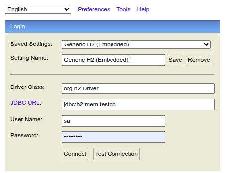

# gestioninventario-backend

Prueba de  Gestion de Inventario Nivel Senior.

* **Para acceder a la base de datos se debe ejecutar el proyecto y acceder a la URL http://localhost:8080/h2-console**
* Cada que se agota el inventario se creara una entrada por 100 unidades mas del producto procesado.El umbral sera de 5 productos
* Antes de procesar productos se debe crear categorias y customers

**userName**: sa

**Password**: password

* **Para consumir los servicos rest, en la paquete  src/main/resources/postmancollection se encuenra una collection de Postman con cada uno de los clientes.**

# NOTA

**Primero debes crear Customers y Categorías**
